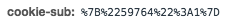
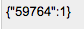
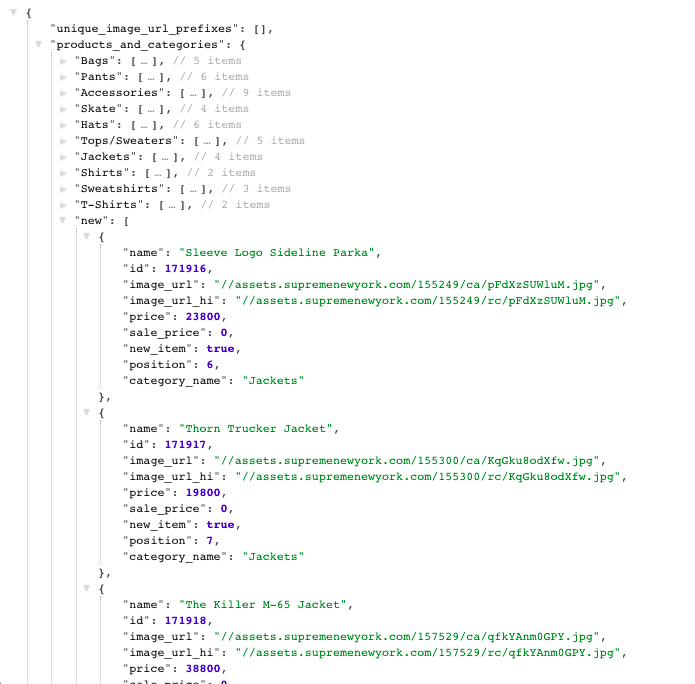
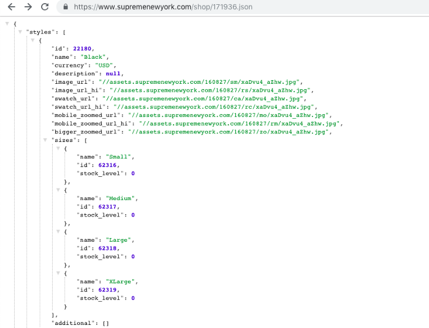
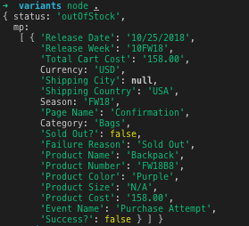

**EDIT: This method is now patched**

Hello folks, due to the overwhelmingly positive feedback of the last two articles I’ve decided to continue this series. In this part I have something interesting that’s been going around the bot scene lately.

# Variants
At first, I had 0 clue what this word meant in the botting community. Context clues weren’t very useful because bot developers love keeping secrets and talking about techniques in abstract ways. Lucky for you, I like sharing my knowledge and I don’t get off on being vague to seem mysterious. So, what are variants?

Variants are the size IDs passed into Supreme’s checkout.json cookie-sub. If you remember from part two, cookie-sub contains a JSON representation of the final size-id and the quantity.

Something interesting is that adding an item to cart is not necessary. The cookie-sub is all the information the checkout.json endpoint needs to cop your items!

The next question is obvious, how do I get the ID of an item that doesn’t exist in mobile_stock.

To answer this, let’s look at mobile_stock.

My first observation was that the items inside the “new” category are incremented by 1. This is major because this means we may be able to bruteforce items by trying a higher ID than the current highest.

Looking at the item’s JSON I also notice that the size IDs are incremented by one. This is looking super EPIC. I won’t take full credit for the next discovery. I was pretty close, my initial attempts included finding correlation between mobile_stock ids and lookbook/preview item ids. The hint I was given is when everything clicked.

# Out of Stock
What happens when we checkout an item that’s out of stock? Only one way to find out.

Hm! Turns out that Supreme is pretty generous with the information given when an item has the outOfStock status. They give us the, item name, item color, item size, and more. Turns out, Supreme’s items are loaded into shop before drops. You can use this to now bruteforce later item IDs!

Once you have the size ID before drop, you are at a HUGE advantage as you’re able to skip the parsing of mobile_stock and item JSON, skip the add.json endpoint, and go straight to your checkout.

That’s all there is to it. The source is available on [Github](https://github.com/blastbots/supreme-variants-finder).
