Jscrambler, a leader in JavaScript Client-side security makes claims to “Bullet-proof your Web Application in 2 minutes” but what have they done to make these claims? And does it really bulletproof your application?

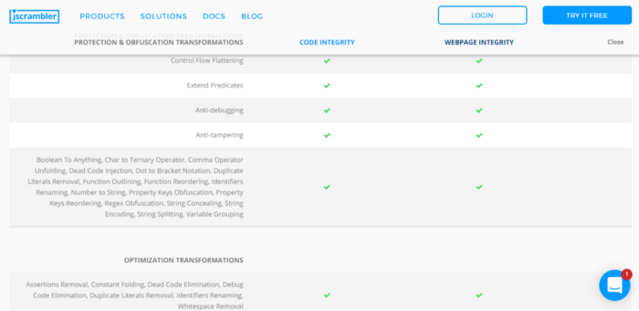

Jscrambler employs various techniques to both obfuscate the code and prevent real-time debugging/tampering. A list of the techniques is provided by the Jscrambler product page and even contains docs to what each feature does (This will be extremely helpful)

# Getting a Sample To Reverse
The first step in reversing Jscrambler is to get our hands on an obfuscated sample. Lucky for us, we’re able to sign up and demo their protection using a game they provide. Even better, they provide the unprotected version as well! This is useful for comparison.

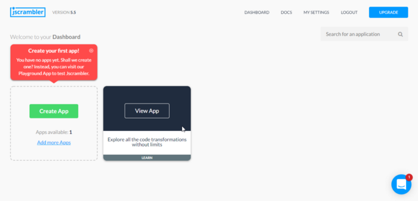

The Playground App is more than enough for us to pick apart how Jscrambler works and how to reverse its effects. Clicking on View App brings you to the page where you’re able to fine-tune the protection to your liking.

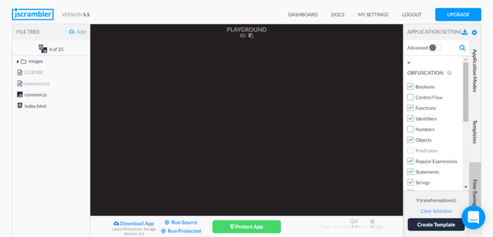

You’re then able to protect the app and run it. Pressing the Run Source and Run Protected buttons will create an iframe with the running application. We’re then able to get the source though the Chrome Dev Tools

# Side by Side Comparison

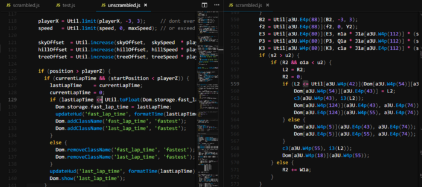

Looking at the obfuscated code vs the original code a few things stood out to me. The first being the difference in lines of code. The protected application sits at 907 lines of code while the original only contains 559. This nearly double in LoC had to be coming from somewhere. The second thing I noticed was all of the obfuscated function calls and string references. A quick glance at their docs brings me to what they call String Concealing

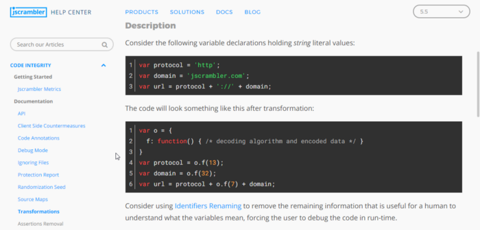

Our protected code is littered with calls to the decode routines so I had a bright idea to isolate the decode functions by copying them to a different file.

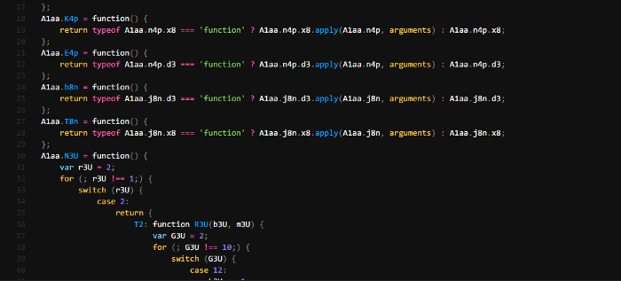

Jumping to the function using ctrl + clicking on one of them brings me to the top of the file where many similar functions are defined. After multiple scrolls I notice our code starts but is wrapped around what seems to be an IIFE

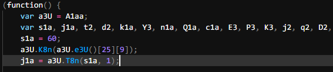

Copying all the functions above this IIFE into another file and removing them from the protected code brings our lines of code from 907 down to 629. This means the majority of the increase in LoC we noticed was due to these decode/encode algorithms.

# Extracting Data From Functions
My next idea was to try and test one of decode functions by just running it and hoping to get no errors.

Well, let’s try that.

To do this, I grabbed one of the calls to the decode function and console.log it in my file with all the decode functions.

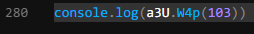

Now, lets call node testing.js

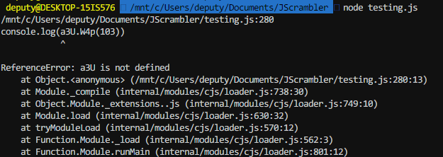

a3U is not defined, hmm. I check back to the protected code and realize a3U is pointing to a global variable named A1aa

So I change a3U in the test to A1aa and try running it again

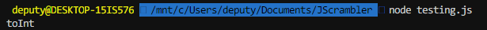

# It Returns toInt!
At this point I was very excited. This means I was able to isolate these functions and use them to deobfuscate the code a bit.

Woohoo!

I even went a step further and used a for loop to try printing out any other strings we can get.

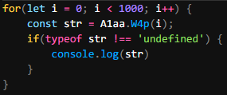

And now to run it.

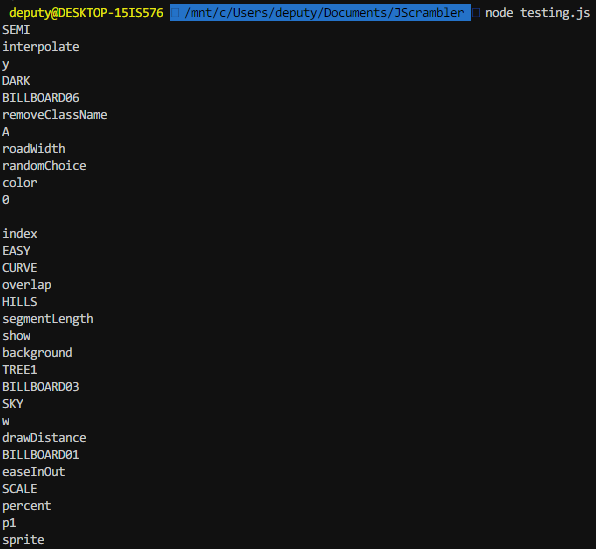

Awesome! We get a bunch of strings and function names.
Only one problem. I don’t really want to sit here and replace each occurrence by hand. Whatever, I’ll just write a script that uses Regex to find these functions and replace them with the results using eval.

# STOP!
While this technique would technically work and is what I started out with, there is a better way to do this and its using an AST.

An Abstract Syntax Tree (AST) is a tree that represents the syntax of a language. For us this means we can pick apart functions and function calls given a set of criteria.

Great, now where do we start?

Esprima is a popular parser and is what we’ll be using to do this.

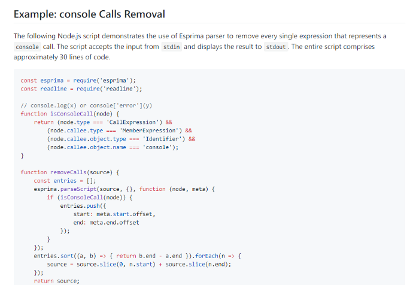

Esprima has an example of removing console calls from a program using their tool. I will be using this as the base to find all the calls to the decode functions and replace them. One tool useful for this is ASTExplorer which allows you to explore the syntax tree of the code you provide.
First step, identifying the decode functions and storing their name so we can find occurrences in the code.
Pasting one of these functions in ASTExplorer lets us know we’re dealing with an ExpressionStatement

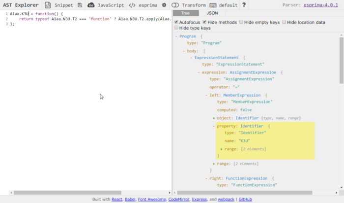

What we care about is K3U or the property identifier

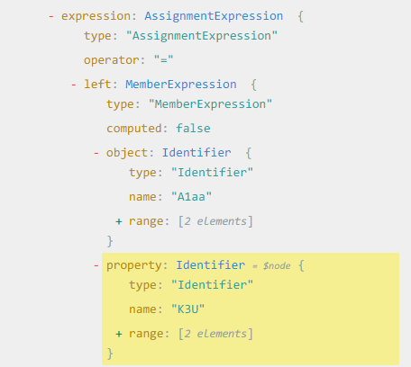

We know each decode function belongs to A1aa so we’ll use that to extract the function names.

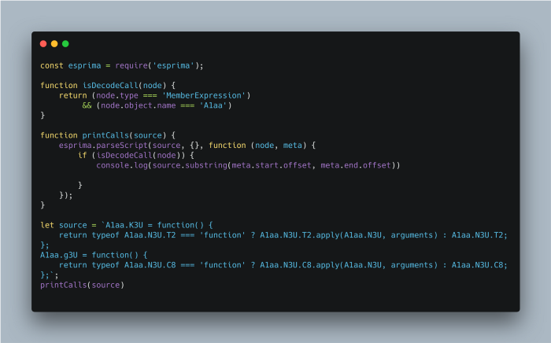

Using this code we’re able to print the decode functions out and take a look.

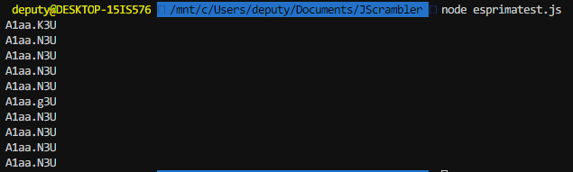

Great, but we only care about the function name.

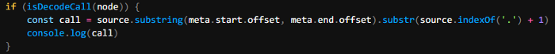

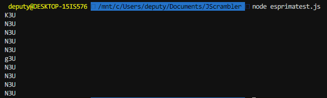

Cool! We got the function names now we need to replace each call to them in the code with their returned value. I return to ASTExplorer but this time inspect a line where one of these decode functions is called.

The call is defined as a CallExpression. Inside the CallExpression contains other information such as the arguments passed, callee, and types.

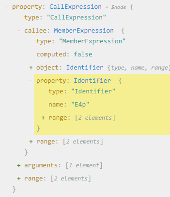

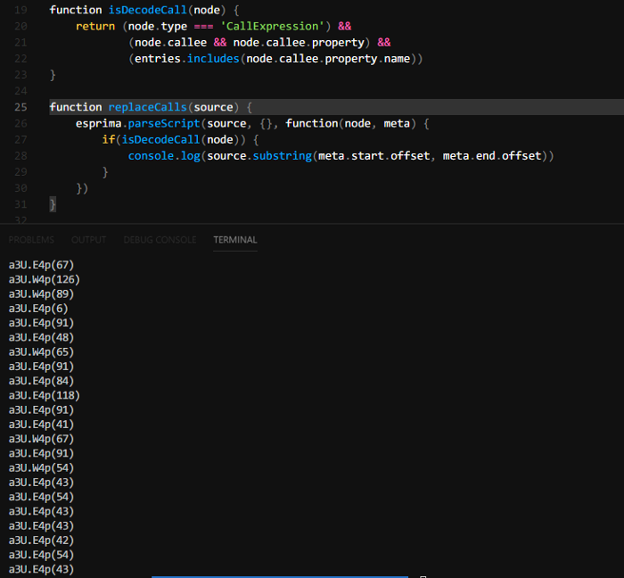

Using ASTExplorer we’re able to build another predicate which checks if the function is a CallExpression and its callee’s property name is one of our decode functions. Now we just want to replace these calls with their actual value!

# The Final Result
Remember our obfuscated code comparison from above? Well this is how the comparison looks after running our script!

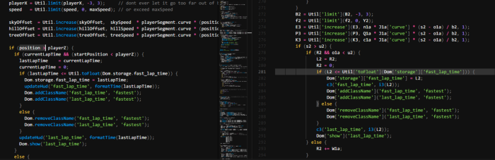

Suddenly a lot more readable! Some function names aren’t recoverable because they aren’t encoded but instead changed into some random garbage. Now that the code is in a more readable state you’re able to look through the file and figure out what it does!

The next part of this series will cover what control flow obfuscation is and how to tackle it.

Source to the script available [here](https://gist.github.com/char/78881ce52466cd6d78f459fe1b969ca4)